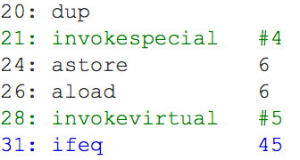
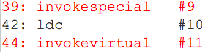

## Lab 1
Оптимизировать вызов http://localhost:8080/lab1/weather?days=<количество_дней>. Код находится в папке lab1. Для всех изменений, связанных с оптимизацией, оставить комментарий, 
что и зачем было изменено. Для сравнения необходимо приложить скриншот до и после оптимизации. Для замеров можно использовать инструменты разработчика
в Chrome. Для обращения к сервисы darksky необходим access token, в лабе он представелн в урле https://api.darksky.net/forecast/ac1830efeff59c748d212052f27d49aa, где access token=ac1830efeff59c748d212052f27d49aa. У него есть ограничение в 1000 запросов день, поэтому вот вам еще несколько токенов: eba0aac253297ed6ba6c6b20ecfe2f78, 7ba6164198e89cb2e6b2454d90e7b41d, 7680422f32effb534f62f1283f0c38be, 3ce5ca6c6c64befaa69dd9cf05b939db, 6df573445c320d1634a227266d1360a3. Так как ограничение 1000 запросов в день, не делайте загрузку погоды за 100 дней за раз, варьируйте от 5 до 10. 

## Lab 2
ЗЗадания описаны в классах пакета `ru.sberbank.lab2`. Полученные результаты по каждому из пунктов каждого класса оформить в любом текстовом файле и отправить в телегу. Ответы оформлять подробно: что наблюдали, почему наблюдаемое такое, какое оно есть. Все вопросы или замечания направляйте также мне в телегу. Дедлайн: 27 октября 23:59. 

## Lab 3
Вам требуется запустить код классов `ru.sberbank.lab3.FirstTask` и `ru.sberbank.lab3.SecondTask`, собрать лог JIT-компиляции и посмотреть их в JitWatch. Все оптимизации, произведенные JIT-компилятором и которые подсвечены в JitWatch в байткоде или в Chain, описать: что это такое, почему она произошла. Пример того, что надо описать на картинках ниже подсвечено красным, зеленым и синим:

Также, в коде вы найдете комментарии, в них содержатся пронумерованные вопросы, на которые надо ответить.
Полученные результаты по каждому из пунктов каждого класса оформить в любом текстовом файле и отправить в телегу. Все вопросы или замечания направляйте также мне в телегу. Дедлайн: 14 декабря 23:59.
